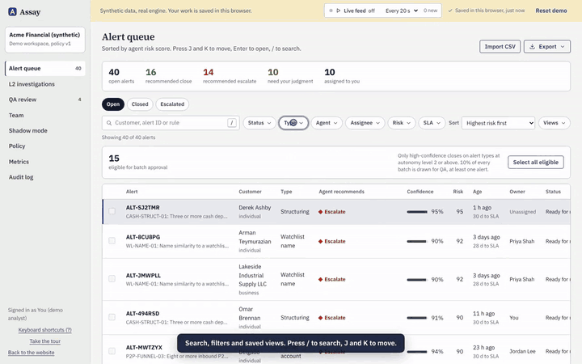
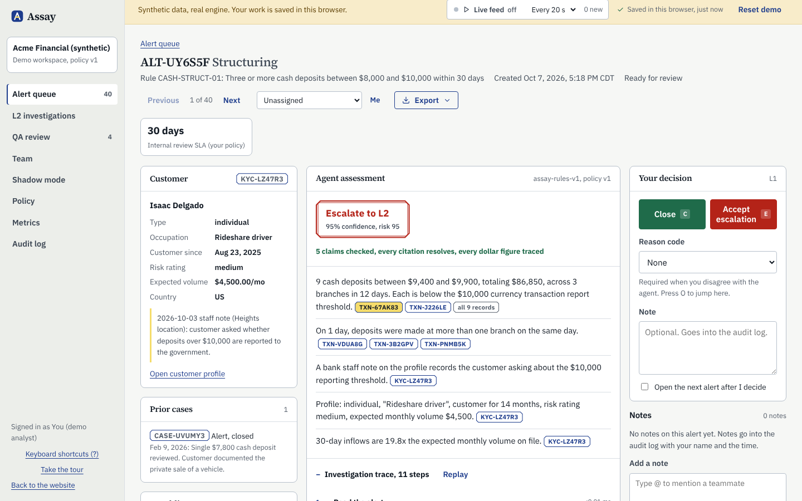
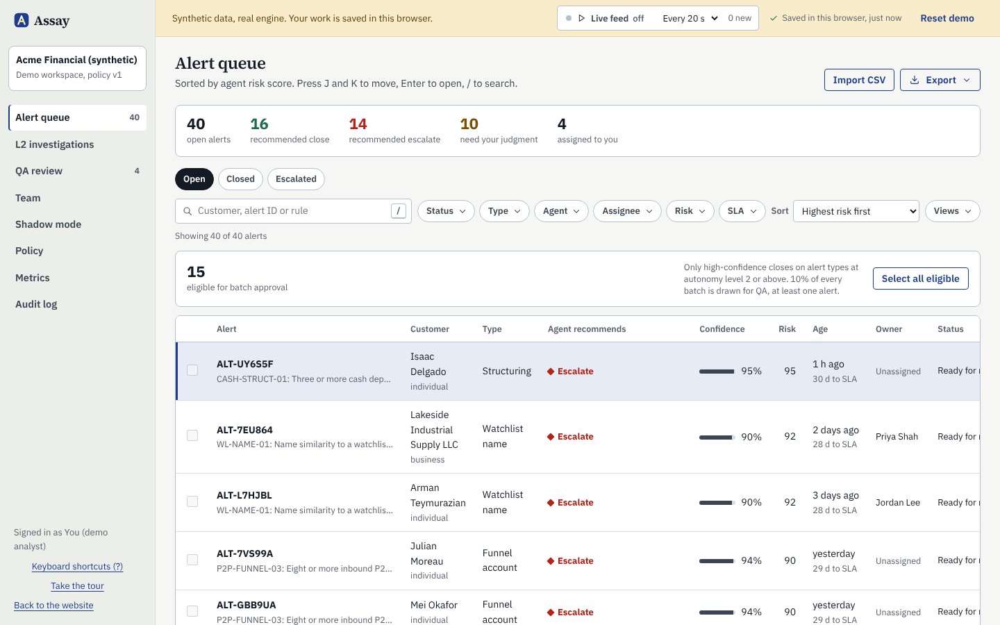
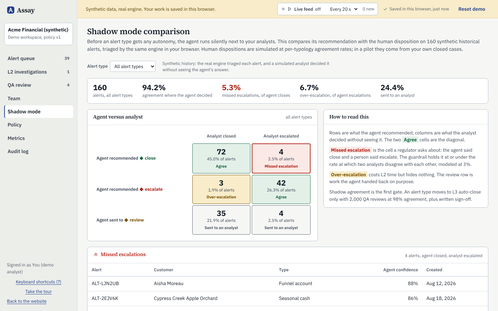
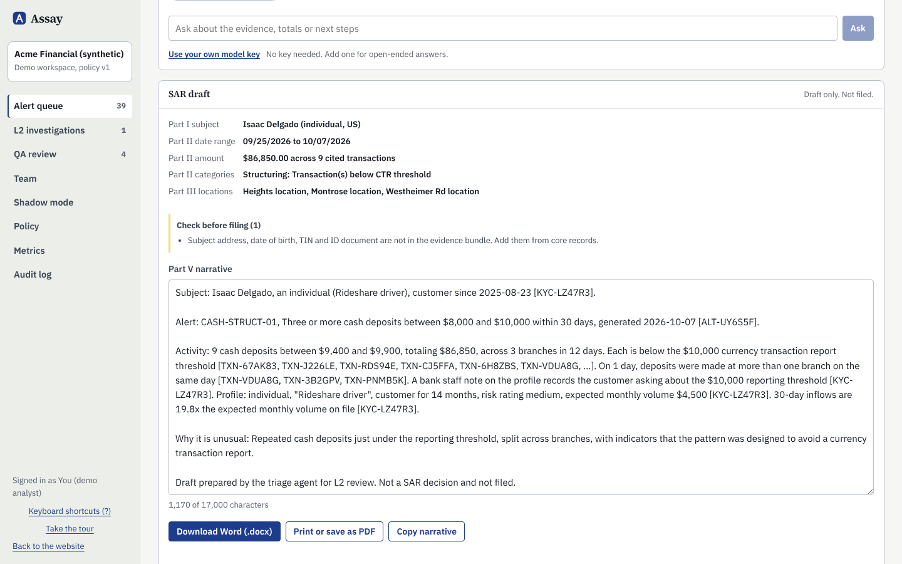
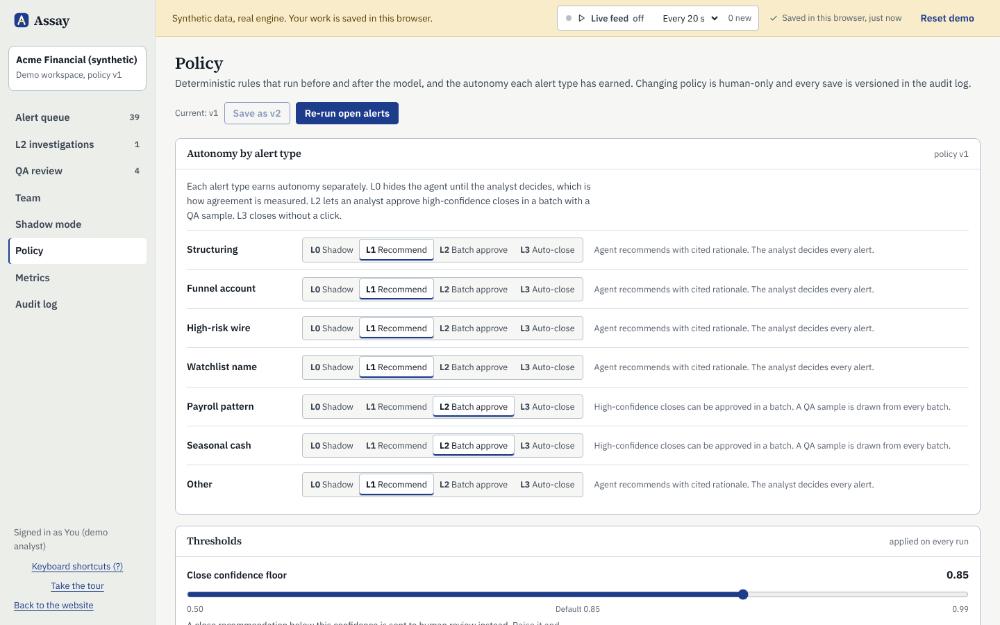
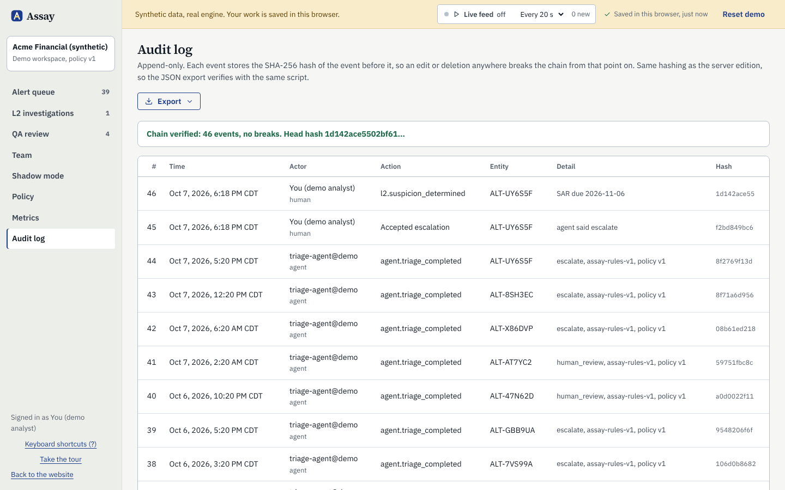

# Assay

**Live site:** https://parikshit7319.github.io/assay-aml-alert-triage/
**Live demo:** https://parikshit7319.github.io/assay-aml-alert-triage/demo/ (44 synthetic alerts, runs in your browser)

An AI first-pass analyst for AML transaction-monitoring alerts. It gathers the evidence, recommends close or escalate with a citation behind every claim, and leaves the decision to a human. Deterministic policy decides what the model is not allowed to do.

"Assay" is a working name. Trademark and domain are not cleared; the name lives in `src/lib/brand.ts`.



The full 90-second walkthrough is on the home page ([MP4](public/media/demo.mp4)).

## Screenshots

| Alert workspace | Queue with filters and saved views |
|---|---|
|  |  |
| **Shadow mode: agent versus analyst** | **SAR draft mapped to FinCEN fields** |
|  |  |
| **Policy editor and autonomy ladder** | **Hash-chained audit log** |
|  |  |

## What is in the box

- **Marketing site:** home with a live engine run in the hero, product, governance, pricing, pilot request, API docs, sources.
- **Public demo:** one click creates a private workspace with 44 synthetic alerts across structuring, funnel accounts, high-risk wires, watchlist names, payroll, seasonal cash, thin files and two prompt-injection attempts. It expires after 24 hours. The GitHub Pages demo runs the same engine in the browser, with a guided tour, keyboard shortcuts (press ?), a live alert feed, CSV upload, "Ask the agent", your own Anthropic or OpenAI key, and state saved in the browser until you reset it.
- **Analyst workbench:** risk-sorted queue with batch approval, alert workspace with clickable citations, alert owners and notes with @mentions and L2 handoffs, team workload, customer view (KYC, every alert, 90-day timeline and counterparty graph), L2 investigations with the SAR clock, QA sampling, metrics with the north star and guardrails, shadow-mode report (agent versus analyst confusion matrix by alert type), hash-chained audit log, CSV import, policy versioning and autonomy levels, API keys, plan and usage.
- **Exports and integrations:** SAR draft as Word or print-ready HTML, model risk documentation pack, audit log (CSV or JSON with the chain check), decisions and QA reviews as CSV, and a signed outbound webhook (JSON, Slack or Teams) for escalations, closes, SAR decisions, assignments and mentions.
- **Operator pages:** pilot requests and first-party site analytics (no cookies, no IP stored) at `/admin`, for emails in `ADMIN_EMAILS`.
- **Triage engine** (`src/lib/engine`): evidence bundle, deterministic typology checks, pre- and post-model policy, model adapters (Anthropic, OpenAI, Azure OpenAI, plus a deterministic rules model), claim-to-record and dollar-figure validation.
- **Revenue plumbing:** workspaces, plans and entitlements (`src/lib/plans.ts`), per-run usage metering with token and cost tracking, Stripe Checkout, billing portal, webhook, and metered overage via Stripe Billing Meters. REST API at `/api/v1/alerts`.

## Run locally

```bash
npm install
npm run dev
```

Open http://localhost:3000 and click **Open the demo**. No database or keys are needed: local mode uses embedded Postgres (PGlite) in `.data/`.

```bash
npm test         # vitest: engine, policy, validation, audit chain, workflow, exports, webhooks, collaboration
npm run build    # production build
```

## Deploy your own

[](https://vercel.com/new/clone?repository-url=https%3A%2F%2Fgithub.com%2FParikshit7319%2Fassay-aml-alert-triage&project-name=assay&repository-name=assay&env=DATABASE_URL&envDescription=A%20Postgres%20connection%20string.%20A%20free%20Neon%20database%20works%3A%20copy%20its%20pooled%20connection%20string.&envLink=https%3A%2F%2Fneon.com%2Fdocs%2Fconnect%2Fconnect-from-any-app)

The button clones this repository into your GitHub account, creates a Vercel project and asks for one value, `DATABASE_URL`. Create a free Postgres database on [Neon](https://neon.com), copy the pooled connection string (it ends in `?sslmode=require`), paste it, and deploy. Nothing else is required:

- **Migrations** run on the first request after each cold start. They are idempotent and take a transaction-scoped Postgres advisory lock, so several instances starting at once queue instead of colliding, and it works behind Neon's pooler.
- **Auth secret.** Without `BETTER_AUTH_SECRET`, production derives a stable one from `DATABASE_URL` and logs a warning. Set your own (`openssl rand -base64 32`) to rotate it separately from the database password.
- **Public URL.** Without `BETTER_AUTH_URL` or `NEXT_PUBLIC_APP_URL`, the app uses Vercel's production domain (`VERCEL_PROJECT_PRODUCTION_URL`), then the deployment URL.
- **Nightly job.** `vercel.json` schedules `/api/cron/rollup` (expired demo cleanup and weekly metric rollups). Set `CRON_SECRET` and Vercel sends it as the bearer token; without it the job refuses to run.
- **No database at all** still boots on Vercel, on a throwaway embedded database in `/tmp` that disappears with the instance. Fine for a look, not for data.

To point the static GitHub Pages edition at your deployment, build it with `NEXT_PUBLIC_APP_ORIGIN=https://your-app.vercel.app` (and optionally `NEXT_PUBLIC_API_BASE` if the API lives elsewhere). Its pilot form then posts to `/api/leads`, its analytics beacon to `/api/track`, and sign-up links go to your server.

**Azure instead:** `docker build -t assay .` and run the image on Azure Container Apps with Azure Database for PostgreSQL. Point `AZURE_OPENAI_*` at a deployment in the same subscription.

GitHub Pages hosts the **static edition** (`node scripts/build-pages.mjs`, deployed by `.github/workflows/pages.yml`): the full marketing site plus the demo running entirely in the browser with the same engine, policy rules and audit chain. The browser demo includes CSV import, a bring-your-own-key live model, notes, assignment, policy changes, exports and saved state; accounts, billing, webhooks and the REST API need the server edition above.

### Environment variables

| Variable | Needed | What it does |
|---|---|---|
| `DATABASE_URL` | Yes, in production | `postgres://` or `postgresql://` URL. Unset locally: embedded PGlite in `.data/`. `memory://` for an in-memory database. |
| `BETTER_AUTH_SECRET` | Recommended | Signs sessions. Derived from `DATABASE_URL` in production when unset. |
| `BETTER_AUTH_URL`, `NEXT_PUBLIC_APP_URL` | No | Public URL for auth callbacks, links in webhooks, Stripe redirects. Falls back to the Vercel URLs, then `http://localhost:3000`. |
| `AUTO_MIGRATE` | No | `false` turns off migrations on start (Postgres only). Default on. |
| `DB_POOL_MAX` | No | Connections per instance. Default 5. |
| `CRON_SECRET` | For the nightly job | Bearer token `/api/cron/rollup` requires. |
| `ADMIN_EMAILS` | For operator pages | Comma-separated emails that can open `/admin/leads` and `/admin/analytics`. |
| `LEAD_WEBHOOK_URL` | No | Also POSTs each pilot request to Slack, Teams or Zapier. |
| `CORS_EXTRA_ORIGINS` | No | Extra comma-separated origins allowed to call `/api/leads`, `/api/track` and `/api/public/stats`. This deployment, `https://parikshit7319.github.io` and `http://localhost:3000` are always allowed. |
| `ANTHROPIC_API_KEY`, `OPENAI_API_KEY`, `AZURE_OPENAI_*` | For live models | See "Turn on a live model". |
| `STRIPE_*` | For billing | See "Turn on billing". |
| `MICROSOFT_CLIENT_ID`, `MICROSOFT_CLIENT_SECRET`, `MICROSOFT_TENANT_ID`, `GITHUB_CLIENT_ID`, `GITHUB_CLIENT_SECRET` | No | Single sign-on buttons. |
| `NEXT_PUBLIC_APP_ORIGIN`, `NEXT_PUBLIC_API_BASE` | Static build only | Where the static edition sends forms, analytics and sign-ups. |

## Turn on billing

1. In Stripe, create a product "Team" with a $1,500 monthly price (`STRIPE_PRICE_TEAM`).
2. Create a Billing Meter with event name `assay_triage_run`, then a metered price on it with graduated tiers: first 2,000 units at $0, then $0.60 (`STRIPE_PRICE_OVERAGE`).
3. Add a webhook to `https://YOUR-DOMAIN/api/stripe/webhook` for `checkout.session.completed`, `customer.subscription.updated` and `customer.subscription.deleted` (`STRIPE_WEBHOOK_SECRET`).
4. Set `STRIPE_SECRET_KEY`. The Upgrade button on **Plan and usage** goes live.

## Turn on a live model

Set `ANTHROPIC_API_KEY` (or the OpenAI or Azure OpenAI variables). Then, in a Team-plan workspace, choose the model under **Policy and autonomy**. Demo and Sandbox workspaces always use the rules model. Every run records which model ran, its tokens and its cost.

## Honest status

- Working software, with no customers yet and no production data processed.
- Performance numbers are modeled and labeled. The demo's weekly history is synthetic.
- No SOC 2 report, independent model validation or penetration test yet.
- Pricing is a hypothesis to test with design partners.
- Before taking real money: form a legal entity, have a lawyer review the privacy and terms pages, and sign a data processing agreement with each pilot customer.

## Layout

```
src/lib/engine      triage pipeline, detectors, policy, validation, model adapters
src/lib/demo        synthetic scenarios, seeding, synthetic metric history
src/lib/workflow.ts analyst actions (L1, batch, L2, SAR, QA, policy)
src/lib/audit.ts    hash-chained audit log
src/lib/metering.ts usage, plan limits
src/lib/billing     Stripe
src/app/(site)      public site
src/app/app         workbench
src/app/api         auth, REST API, Stripe webhook, cron, health
test/               vitest suites
```
